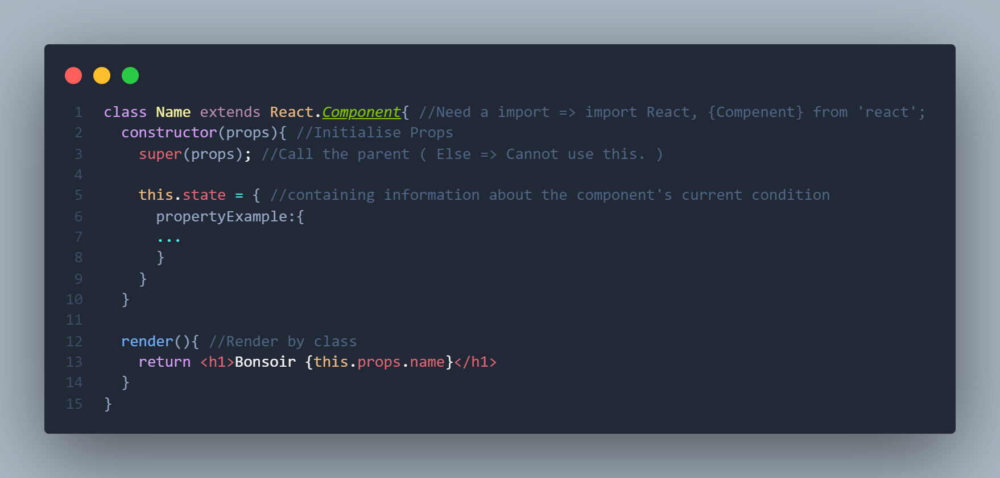
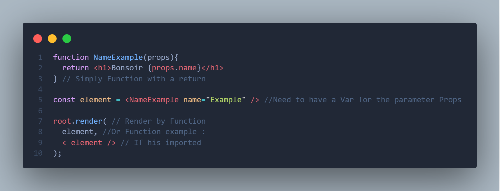

TodoList with React By Lunasha
===

## What's your opinion about React ?
    Lunasha : Yeah, it's my first Time with React.
              But, since the beginning, React is really easy.
              Just take the time to understand Function VS Class & States.
              States at the beginning, is not really easy ! With work, yep !
              React is really great. Normally, i don't like the front...
              And here i liked... What's wrong with React & Me ???

## Why did this project ?
    Lunasha : For BeCode, they gave us this project for the first time with React !
              Thanks BeCode for this project & this discovery!
              React Dev Soon??? ( No, i'm joking ! )

## Anything to say about Function VS Class?
    Lunasha:  Generally if the compenant, we use class for give more property

              A compenent render() method takes no argument 

              ReactDOM.RENDER need to take argument to work 

              If you want to use class for a render, generally you need to export this

              The function can did inside the global & is more flexible if you need to update this

              Render simple create a virtual dom and don't put inside the DOM browser

              ReactDOM.Render create a virtual dom and put inside the DOM browser

              ReactDOM.Render => ReactDOMCLient since React 18 ( 29 March 2022 )

              ( Hey to my coach btw, She will recognize herself 😊 )

## And about States ?
    Lunasha: Take your time for understand the states & how they work !

## Functionnalities about your TodoList ?
    Add a Task => Add Bar + Button add ( Or Enter to add the task )

    Check a task => Click on the Square
    Rename a task => Double click on the Name of Task

    Clean => Delete ALL tasks in the list
    All => View all tasks
    Completed => View completed tasks
    Uncompleted => View uncompleted tasks

    And more later...

## Technologies used ?

